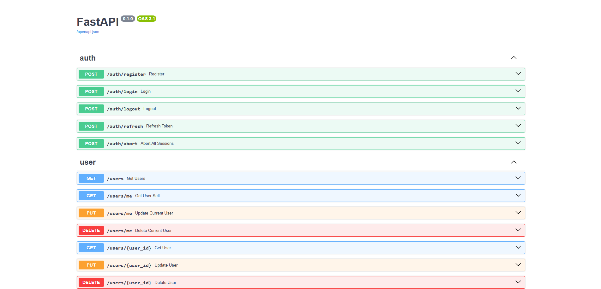
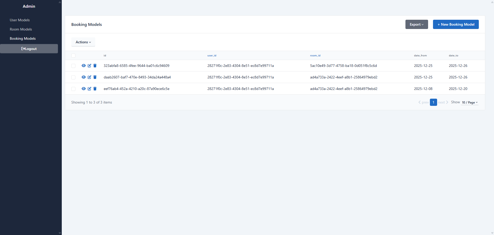

# Приложение для бронирования комнат в отеле

Данное приложение представляет собой REST API для бронирования комнат в отеле, реализованное на базе **FastAPI**, **SQLAlchemy** и **Pydantic**.

## Основные возможности

### Пользователи
- Регистрация новых пользователей
- Авторизация с использованием JWT-токенов
- Разграничение прав доступа (пользователь / суперпользователь)

### Комнаты
- Просмотр списка комнат без авторизации
- Фильтрация комнат по:
  - цене за сутки
  - количеству мест
- Сортировка комнат по цене

### Поиск свободных комнат
- Поиск комнат, доступных в заданном временном интервале

### Бронирование
- Бронирование комнат авторизованными пользователями
- Просмотр списка собственных бронирований
- Отмена бронирований пользователем или суперпользователем

### Администрирование
- Добавление, редактирование и удаление комнат
- Доступно только пользователям с правами администратора

---

## Используемые технологии

- **FastAPI** — backend REST API
- **SQLAlchemy (Async)** — асинхронная работа с базой данных
- **Pydantic v2** — валидация и сериализация данных
- **Alembic** — миграции базы данных
- **PostgreSQL** — реляционная база данных
- **JWT** — аутентификация и авторизация
- **SQLAdmin** — административная панель

---

# Как запустить проект

## 1. Установка зависимостей

Проект использует [Poetry](https://python-poetry.org/) для управления зависимостями.  
Установите их командой:

```
poetry install
```

## 2. Настройка базы данных и миграции

Проект использует Alembic для управления миграциями базы данных.

1) Убедитесь, что настроена база данных postgres и DATABASE_URL прописан в .env файле проекта.
2) Примените миграции: 
```
poetry run alembic upgrade head
```

## 3. Запуск приложения
Для запуска FastAPI сервера используйте:
```
poetry run uvicorn src.main:app --reload
```

---

# Документация и администрирование

## Swagger UI (/docs)
Приложение предоставляет автоматически сгенерированную интерактивную документацию API на основе OpenAPI.

Доступно по адресу:
```
/docs
```

В Swagger UI вы можете:
- Просматривать все доступные эндпоинты
- Тестировать запросы прямо из браузера
- Выполнять авторизацию и отправлять защищенные запросы



---

## Admin Panel (/admin)
Для управления данными предусмотрена административная панель.

Доступно по адресу:
```
/admin
```


